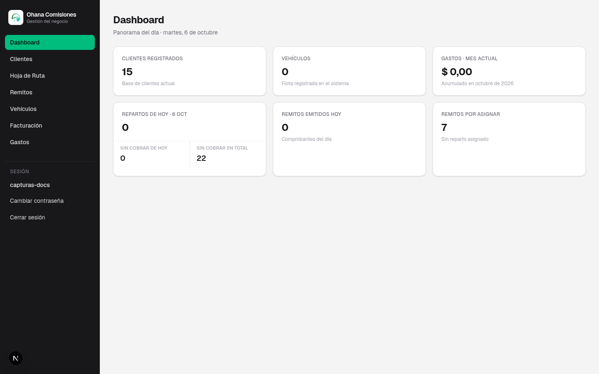

# Ohana Comisiones

Sistema web de gestión operativa para comercios de distribución y comisiones: clientes en cuenta corriente, hoja de ruta diaria, remitos, gastos y flota. Aplicación privada con login, base en la nube (Turso) y despliegue serverless (Vercel).

| | |
|---|---|
| **Repositorio** | [github.com/StraubMatias/Ohana-Comisiones](https://github.com/StraubMatias/Ohana-Comisiones) |
| **Documentación** | [docs/DOCUMENTACION.md](./docs/DOCUMENTACION.md) (alcance, módulos y **capturas de pantalla**) |
| **Stack** | Next.js 16 · React 19 · TypeScript · Tailwind 4 · Turso (libSQL) |

<p align="center">
  
</p>

---

## Módulos

| Módulo | Descripción |
|--------|-------------|
| Dashboard | Métricas del día y del mes |
| Clientes | Deuda, ficha, importación Excel/CSV |
| Hoja de ruta | Repartos, cobranza, gastos del día y **rinde** |
| Remitos | Numeración correlativa e impresión |
| Gastos | Por categoría y mes |
| Vehículos | Flota y service |
| Facturación | Enlaces a AFIP (no factura electrónica integrada) |

---

## Inicio rápido

```bash
git clone https://github.com/StraubMatias/Ohana-Comisiones.git
cd Ohana-Comisiones
npm ci
cp .env.example .env.local
# Completar TURSO_* y SESSION_SECRET (o usar SQLite local sin Turso)
npm run db:migrate
npm run dev          # con Turso si tenés .env.local
# o, solo SQLite:  npm run dev:local
```

Abrí `http://localhost:3000`. Tras la primera migración, si no hay usuarios, `migrate.mjs` crea administradores iniciales; **cambiá las contraseñas** en **Cuenta**.

### Variables de entorno

| Variable | Uso |
|----------|-----|
| `TURSO_DATABASE_URLL` | URL libSQL (`libsql://…`) |
| `TURSO_AUTH_TOKENN` | Token Turso |
| `SESSION_SECRET` | Firma de cookies (`openssl rand -hex 32`) |

Sin `TURSO_*` en desarrollo se usa `file:local.db` (ignorado por git).

---

## Scripts

| Comando | Acción |
|---------|--------|
| `npm run dev` | Desarrollo |
| `npm run build` / `start` | Producción |
| `npm run clean` | Borra `.next` (caché local) |
| `npm test` | 101 tests (Vitest) |
| `npm run lint` | ESLint |
| `npm run db:migrate` | Esquema y migraciones |
| `npm run dev:local` | Desarrollo sin Turso (`local.db`) |
| `npm run db:seed-demo` | Datos de demo en **solo** `local.db` |

---

## Arquitectura (resumen)

```
Navegador → proxy.ts (sesión HMAC) → App Router
              → Server Actions → lib/data → Turso / SQLite
```

- Rutas privadas en `app/(app)/` (rol admin).
- Consultas en **batch** en dashboard y hoja de ruta.
- Cache Components + `revalidateTag` en listados.
- Seguridad: scrypt, rate limit de login, CSP/HSTS en producción.
- CI: [`.github/workflows/ci.yml`](./.github/workflows/ci.yml) (lint, test, build).

Detalle de carpetas, despliegue y pruebas: secciones ampliadas en versiones anteriores del README; la referencia funcional completa está en **[docs/DOCUMENTACION.md](./docs/DOCUMENTACION.md)**.

---

## Estructura esencial

```
app/           # UI y rutas (App Router)
lib/           # Dominio, auth, schema.sql, migrate.ts
scripts/       # migrate.mjs (único script operativo obligatorio)
docs/          # DOCUMENTACION.md, screenshots y scripts locales (no producción)
proxy.ts       # Autenticación global
```

Archivos auto-generados por Next (`AGENTS.md`, `CLAUDE.md`) están en `.gitignore`.

---

## Despliegue

**Vercel** + **Turso**: configurar las tres variables de entorno, ejecutar `npm run db:migrate` sobre la base remota y desplegar `main`.

---

## Licencia

Proyecto privado. Uso autorizado solo para el titular del negocio y quienes desarrollen o mantengan el sistema.
